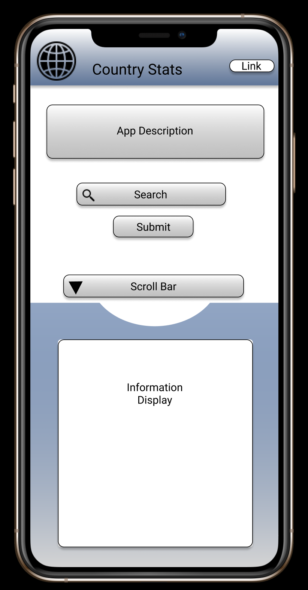
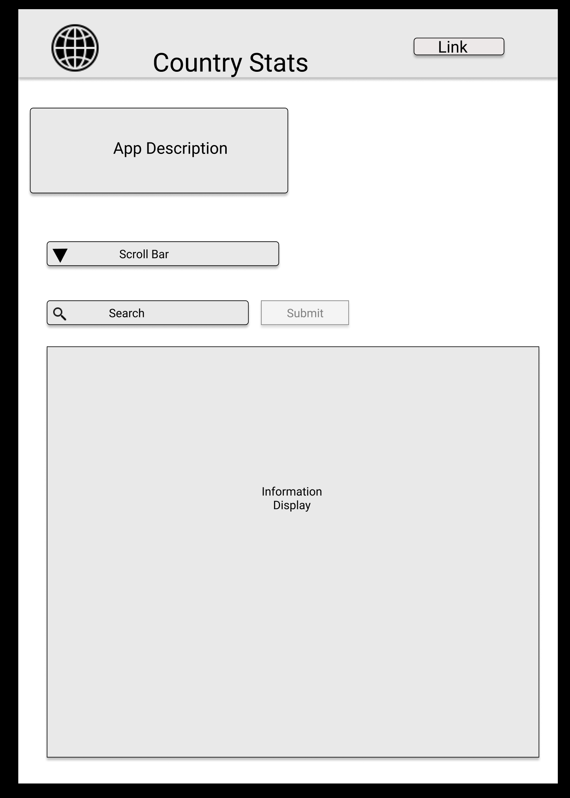
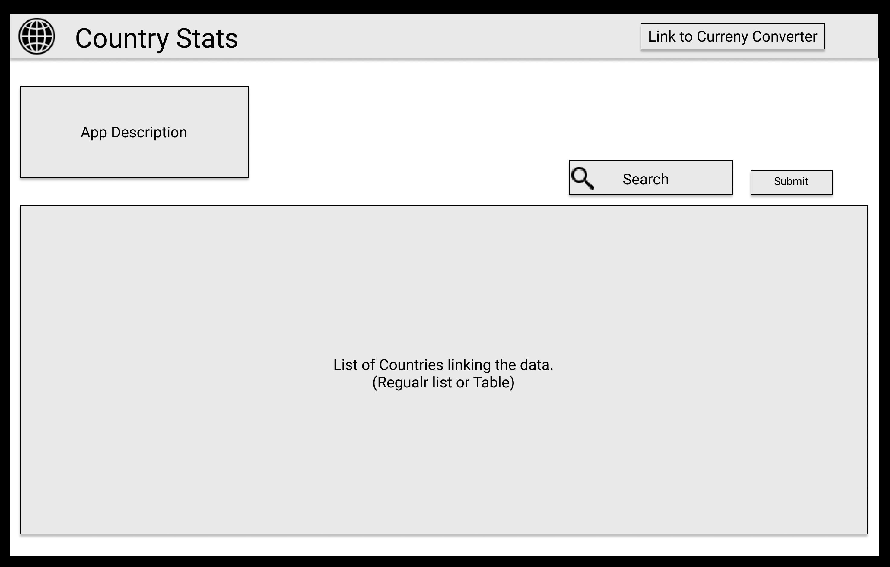

# Country-Stats

- [Project Planning](#Project-Planning)
  - [Overview](#Overview)
  - [Wireframes](#Wireframes)
  - [MVP](#MVP)
    - [Goals](#Goals)
    - [Libraries](#Libraries)
    - [Data](#Data)
    - [Component Hierarchy](#Component-Hierarchy)
    - [Component Breakdown](#Component-Breakdown)
    - [Component Estimates](#Component-Estimates)
    - [Helper Functions](#Helper-Functions)
  - [Post-MVP](#Post-MVP)
- [Project Delivery](#Project-Delivery)
  - [Code Showcase](#Code-Showcase)
  - [Code Issues & Resolutions](#Code-Issues--Resolutions)

## Project Planning

<br>

### Overview

**Country Stats** is an informative app. User will be able to select which county they wish to learn about. Some details include: name, region, language, currency, etc. The list of countries will be in alphabetical order. User may go through the list or search for a specific country.

<br>

### Wireframes

- Mobile
  

- Tablet
  

- Desktop
  

<br>

### MVP

_The **Country Stats** MVP will focus on letting users have an easily interactive product. Whether on a phone, tablet, or desktop, user will be able to navigate through the application and find the information they require. I will be aiming to achieve the following goals:_

#### Goals

- _Successfully import data from the API._
- _Utilize the data and implement it in a format based on the respective layout._
  - _Allow user to search for the specified country._
    - _Display the data of the country searched._
  - _Allow user to scroll through the countries on smaller devices._
    - _Display the data of selected country._
  - _Display a list of the countries on desktop mode._
    - _Link the country name to its respective data._

<br>

#### Libraries

|   Library    | Description                                         |
| :----------: | :-------------------------------------------------- |
| React Router | _Will be used to link countries to its data._       |
|  Story Book  | _Will be used to create buttons, search bars, etc._ |
|    Axios     | _Will be used to get data from API._                |

<br>

#### Data

|       API        | Quality Docs? | Website            | Sample Query                                              |
| :--------------: | :-----------: | :----------------- | :-------------------------------------------------------- |
| Rest Country API |      Yes      | _restcountries.eu_ | _https://restcountries.eu/rest/v2/name/usa?fullText=true_ |

<br>

#### Component Hierarchy

```
src
|__ Components/
      |__ App
            |__ App.js
            |__ App.css
      |__ CountryData
            |__ CountryData.js
            |__ CountryData.css
      |__ CountryList
            |__ CountryList.js
            |__ CountryList.css
      |__ Description
            |__ Description.js
            |__ Description.css
      |__ Header
            |__ Header.js
            |__ Header.css
      |__ ScrollBar
            |__ ScrollBar.js
            |__ ScrollBar.css
      |__ SearchBar
            |__ SearchBar.js
            |__ SearchBar.css
      |__ SearchButton
            |__ Button.js
            |__ Button.css
      |__ Stories
            |__ HomeButton
            |__ LinkButton
            |__ ScrollBar
            |__ SearchBar
            |__ SearchButton

```

<br>

#### Component Breakdown

|  Component   |    Type    | state | props | Description                                                             |
| :----------: | :--------: | :---: | :---: | :---------------------------------------------------------------------- |
|     App      | functional |   n   |   n   | _The App will be my main component._                                    |
| CountryData  | functional |   y   |   y   | _The CountryData will display the country information._                 |
| CountryList  | functional |   y   |   y   | _The CountryList will display a list of countries linked to data._      |
| Description  | functional |   n   |   n   | _The Description will display the description of the product._          |
|    Header    | functional |   n   |   n   | _The Header will contain the logo/title and a link._                    |
|  ScrollBar   | functional |   y   |   y   | _The ScrollBar will contain a scrollable list of countries._            |
|  SearchBar   | functional |   y   |   y   | _The SearchBar will allow user to search for countries._                |
| SearchButton | functional |   y   |   y   | _The SearchButton will be used with the SearchBar to search countries._ |
|   Stories    | functional |   n   |   y   | _The Stories will be used to set up the components._                    |

<br>

#### Component Estimates

| Task                 | Priority | Estimated Time | Time Invested | Actual Time |
| -------------------- | :------: | :------------: | :-----------: | :---------: |
| App                  |    H     |      2 hr      |      hrs      |     hrs     |
| CountryData          |    H     |     6 hrs      |      hrs      |     hrs     |
| CountryList          |    H     |     6 hrs      |      hrs      |     hrs     |
| Description          |    L     |     .5 hr      |      hrs      |     hrs     |
| Header               |    H     |     2 hrs      |      hrs      |     hrs     |
| ScrollBar            |    H     |     6 hrs      |      hrs      |     hrs     |
| SearchBar            |    H     |     6 hrs      |      hrs      |     hrs     |
| SearchButton         |    H     |    2.5 hrs     |      hrs      |     hrs     |
| Stories              |    M     |    2.5 hrs     |      hrs      |     hrs     |
| CSS                  |    L     |    4.5 hrs     |      hrs      |     hrs     |
| Unexpected Debugging |    L     |     2 hrs      |      hrs      |     hrs     |
| TOTAL                |          |     40 hrs     |      hrs      |     TBD     |

<br>

### Post-MVP

- _Add maps to each countries using a second source._
- _Link my Project 1 (Currency Converter) into this project._

<br>

#### Helper Functions

> Use this section to document all helper functions– generic functions that can be reused in other applications.

|  Function  | Description                                |
| :--------: | :----------------------------------------- |
| Capitalize | _Lorem ipsum dolor sit amet, consectetur._ |

<br>

---

## Project Delivery

### Code Showcase

> Use this section to include a brief code snippet of functionality that you are proud of and a brief description.

### Code Issues & Resolutions

> Use this section to list of all major issues encountered and their resolution, if you'd like.
